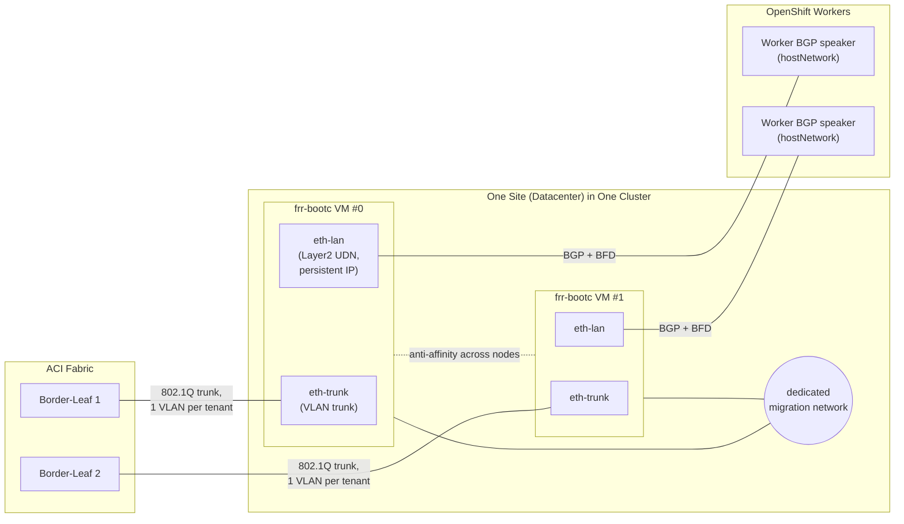

# Architecture

## Topology

Two VM replicas shown; the actual count is `site.replicas` in each site's
`values.yaml` (see `generator/generate.py`).

## Config-sync mechanism (inside a VM)

See the [repo root README](../../README.md) for the full detail; in short,
`frr-config`/`network-config` ConfigMaps are mounted via virtiofs and
watched by systemd `.path` units, which apply changes live
(`vtysh -C` + `frr-reload.py` for FRR, `nmstatectl apply` for networking) -
no VM restart. This GitOps repo's whole design (fixed ConfigMap names, no
templated VM count changes without an explicit `replicas` bump) exists to
preserve that property end-to-end from `tenants.yaml` down to the guest.

## Where each requirement is implemented

| Requirement | Where |
|---|---|
| VLAN trunk on its own NIC, not br-ex/OVN | `base/nad/trunk.yaml` (no `vlan` field = trunk port), `base/vm/virtualmachine-example.yaml` (`eth-trunk` interface), `base/nncp/trunk-uplink.yaml` (host bridge, `vlan-filtering: true`) |
| VLAN sub-interfaces via nmstate, not per-tenant NIC | `generator/templates/nmstate.yml.j2` (`type: vlan`, `base-iface: eth-trunk`) |
| VRF per tenant | `generator/templates/nmstate.yml.j2` (`type: vrf`, `route-table-id`) + `frr.conf.j2` (`router bgp ... vrf ...`) |
| Policy-based routing by source prefix, not ingress interface | `generator/templates/nmstate.yml.j2` `route-rules.config` (`ip-from`, not an FRR `pbrd` map) |
| Route-leaking tenant VRF ↔ default | `generator/templates/nmstate.yml.j2` `routes.config` (leaked route into the tenant's own table, reachable via `eth-lan`) |
| No automatic NAT/NPT for overlapping tenant prefixes | Deliberately not implemented - `ci/validate.py`'s overlap check *rejects* overlapping tenant prefixes within a site instead of silently NATting them, so real client IPs stay visible; conflicting assignments must be resolved in `tenants.yaml` (different prefixes) |
| Worker↔FRR peering, Layer2 UDN, persistent IPs | `base/nad/peering.yaml` (`allowPersistentIPs: true`, `topology: layer2`), `base/nncp/peering-uplink.yaml` (host-side attachment) |
| Dedicated live-migration network | `base/cluster-infra/migration-nad.yaml` + `migration-nncp.yaml`, referenced from `base/cluster-infra/hyperconverged-patch.yaml`'s `liveMigrationConfig.network` - cluster-scoped, applied once per cluster via `argocd/applicationset-cluster-infra.yaml`, deliberately **not** a VM interface |
| BFD (100-300ms) | `tenants.yaml`'s `bfd:` block per tenant → `frr.conf.j2` (`bfd profile ...`, `neighbor ... bfd profile ...`) |
| Graceful-restart / graceful-shutdown | `frr.conf.j2` (`bgp graceful-restart`), `base/vm/virtualmachine-example.yaml`'s `terminationGracePeriodSeconds` (gives the guest's systemd `ExecStop` time to run a BGP graceful-shutdown before the domain stops - the closest KubeVirt equivalent of a Pod `preStop` hook) |
| ~100Gbit/s sizing: dedicatedCpuPlacement, hugepages, multiqueue | `base/vm/virtualmachine-example.yaml` and `generator/templates/virtualmachine.yaml.j2`, values from `cluster.yaml`/`values.yaml` `resources:` |
| Redundancy across nodes/datacenters | `podAntiAffinity` in the VM template (per site, across nodes) + one Argo `Application` per site (across datacenters) - see `argocd/applicationset-sites.yaml`'s matrix generator |
| Per-cluster tenant list | `clusters/<cluster>/sites/<site>/tenants.yaml` |
| Per-cluster ASN range | `clusters/<cluster>/cluster.yaml` `asn_range`, enforced by `ci/validate.py` (in-range + no cross-cluster range collision) |
| Per-cluster/site replica count | `values.yaml` `site.replicas` (falls back to `cluster.yaml` `default_replicas`) |
| Per-cluster/site resource profile | `values.yaml` `site.resources` (falls back to `cluster.yaml` `default_resources`) |
| Per-cluster image/version (staged rollout) | `cluster.yaml` `default_image` / `values.yaml` `site.image` - e.g. `cluster-forge-b` pins a `-rc1` tag ahead of `cluster-forge-a` |
| Cluster registration without touching ApplicationSet code | `argocd/applicationset-sites.yaml`'s cluster generator (selector on a label) × git directory generator (glob) - see `docs/runbook-add-cluster.md` |
| Shared logic vs. per-cluster values | `base/` + `generator/templates/` (edited rarely) vs. `clusters/**/*.yaml` (edited per change) |
| Per-cluster sync policy | `cluster.yaml` `sync_policy`, mirrored onto the cluster Secret's `frr-bootc.io/sync-policy` label, read by both ApplicationSets' Go templates |
| CI: prefix/ASN overlap within + across clusters | `ci/validate.py` (`check_site`, `check_cross_cluster`, `check_asn_ranges`) |
| CI: FRR config syntax | `ci/validate.py` → `vtysh -f frr.conf -C` (same command the frr-bootc image itself runs, see `frr-config-sync` in the repo root) |
| CI: nmstate schema | `ci/schema/site.schema.json` (jsonschema) - see caveat in `ci/validate.py`'s docstring about full `nmstatectl` validation needing a real NetworkManager backend |
